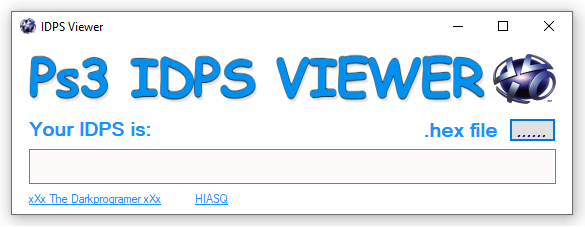

# PS3-IDPS-Viewer

  

source code by [xXxTheDarkprogramerxXx](https://github.com/xXxTheDarkprogramerxXx)
The program was built to open files in a format (.bin) - dump by "e3 flasher"

### What's New

"UPDATE" The program with a slight change and modified the Design, and the source code to open files in a format (.hex), dump by Hen tools 

use [PS3 IDPS Dumper](http://ps3xploit.com/hfw/dumper/index_idps.html) to DUMP your IDPS ((by PS3Xploit Team))

follow on twitter [HIASQ](https://twitter.com/HIASQ2)
